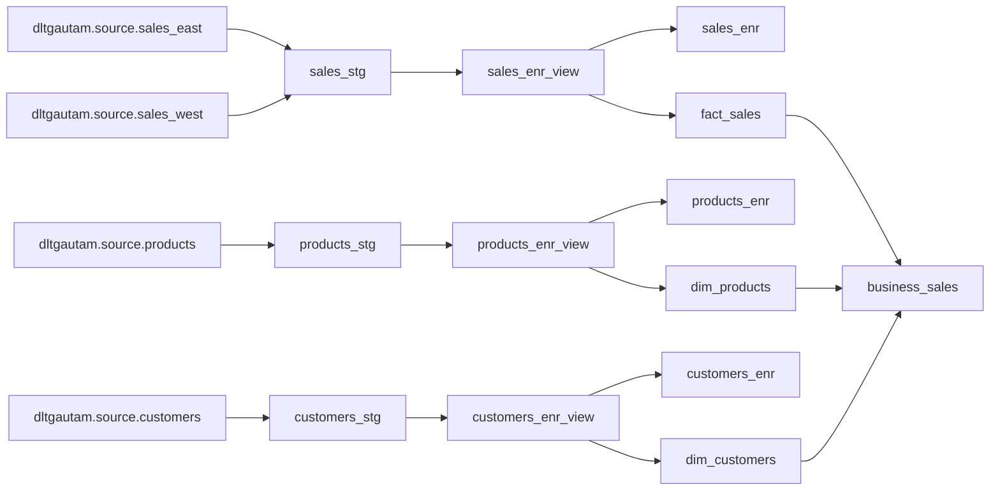
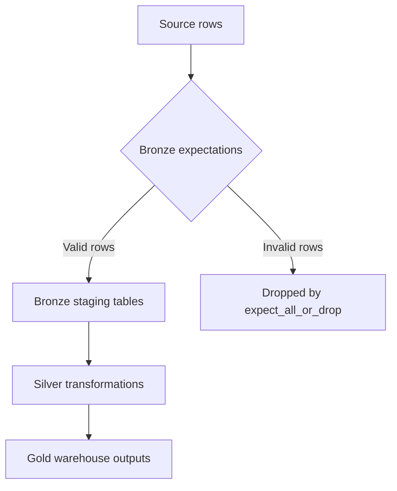

# DLT Pipeline Source

This folder contains the Databricks Declarative Pipelines / Delta Live Tables source code for the sales warehouse pipeline. The repository root README explains the full project, including setup instructions and diagrams. This README focuses on how the pipeline code inside `DLT_Root` is organized.

## Pipeline Layout

```text
DLT_Root
|-- README.md
|-- explorations
|   `-- sample_exploration.py
|-- transformations
|   |-- bronze
|   |   |-- ingestion_customers.py
|   |   |-- ingestion_products.py
|   |   `-- ingestion_sales.py
|   |-- silver
|   |   |-- transform_customers.py
|   |   |-- transform_products.py
|   |   `-- transform_sales.py
|   |-- gold
|   |   |-- business_sales.py
|   |   |-- dim_customers.py
|   |   |-- dim_products.py
|   |   `-- fact_sales.py
|   `-- tutorial
|       |-- 1_CoreComponents.py
|       `-- 2_Dependency.py
`-- utilities
    `-- utils.py
```

## Pipeline Diagram



## Layer Responsibilities

### Bronze

Bronze files ingest source tables and apply basic quality checks.

| File | Output | Notes |
| --- | --- | --- |
| `transformations/bronze/ingestion_sales.py` | `sales_stg` | Appends east and west sales streams into one staging table. |
| `transformations/bronze/ingestion_products.py` | `products_stg` | Drops rows with missing product IDs or negative prices. |
| `transformations/bronze/ingestion_customers.py` | `customers_stg` | Drops rows with missing customer IDs or names. |

### Silver

Silver files standardize data and create CDC-managed enriched tables.

| File | Outputs | Notes |
| --- | --- | --- |
| `transformations/silver/transform_sales.py` | `sales_enr_view`, `sales_enr` | Adds `total_amount` and applies SCD Type 1 by `sales_id`. |
| `transformations/silver/transform_products.py` | `products_enr_view`, `products_enr` | Casts `price` and applies SCD Type 1 by `product_id`. |
| `transformations/silver/transform_customers.py` | `customers_enr_view`, `customers_enr` | Uppercases customer names and applies SCD Type 1 by `customer_id`. |

### Gold

Gold files publish analytics-ready facts, dimensions, and a sales mart.

| File | Output | Notes |
| --- | --- | --- |
| `transformations/gold/fact_sales.py` | `fact_sales` | Sales fact table with SCD Type 1 behavior. |
| `transformations/gold/dim_products.py` | `dim_products` | Product dimension with SCD Type 2 history. |
| `transformations/gold/dim_customers.py` | `dim_customers` | Customer dimension with SCD Type 2 history. |
| `transformations/gold/business_sales.py` | `business_sales` | Aggregates total sales by `region` and `category`. |

## Data Quality Expectations



Current rules:

- `sales_stg`: `sales_id is not NULL`
- `products_stg`: `product_id is not NULL`
- `products_stg`: `price >= 0`
- `customers_stg`: `customer_id is not NULL`
- `customers_stg`: `customer_name is not NULL`

## Running From Databricks

1. Create the source tables with `../DWH_Source.dbquery.ipynb`.
2. Create or open a Databricks Declarative Pipeline that uses this `DLT_Root` folder.
3. Set the target schema, for example `dltgautam.dlt_schema`.
4. Run the full pipeline.
5. Validate `dim_products` and `business_sales` with `../Checking.dbquery.ipynb`.

## Adding New Datasets

Use the existing layer pattern:

1. Add raw ingestion and expectations in `transformations/bronze`.
2. Add cleaning, type handling, derived columns, and CDC preparation in `transformations/silver`.
3. Add fact, dimension, or aggregate outputs in `transformations/gold`.
4. Keep business keys and sequence columns explicit for all `dlt.create_auto_cdc_flow` calls.

## Utilities

`utilities/utils.py` currently provides an `is_valid_email` PySpark UDF. Import utilities from this folder when validation or transformation logic needs to be reused across pipeline files.

## Notes

- Source tables are currently referenced as `dltgautam.source.*`.
- `business_sales` depends on `fact_sales`, `dim_customers`, and `dim_products`.
- Tutorial files under `transformations/tutorial` are commented examples and are separate from the active sales warehouse pipeline.
