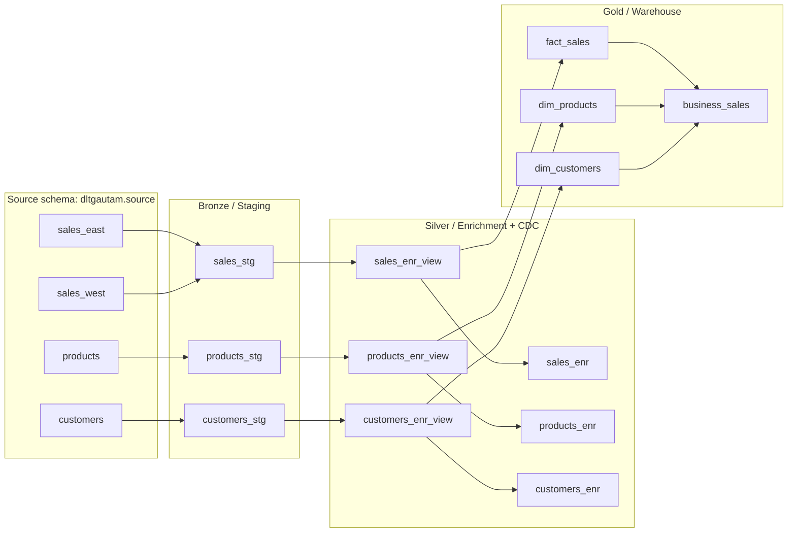
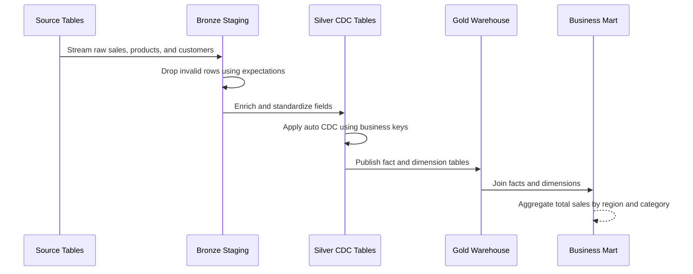
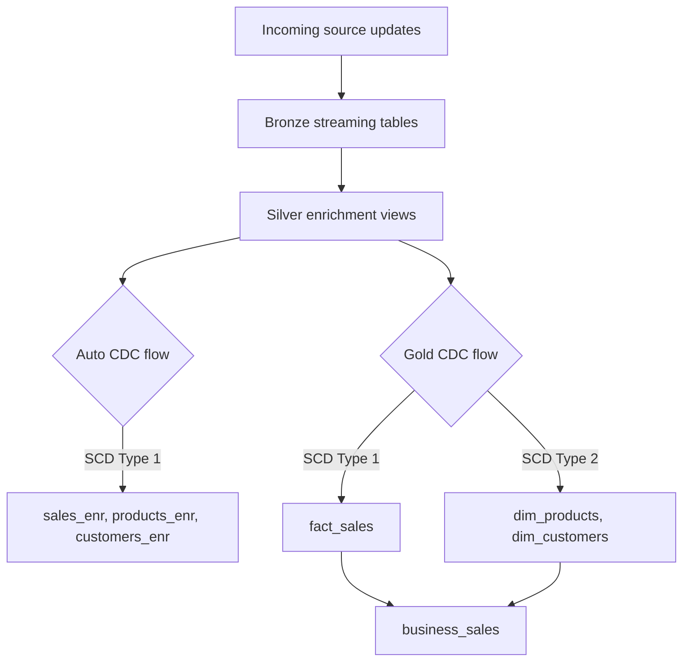

# Databricks Declarative Pipelines DLT

This repository contains a Databricks Declarative Pipelines / Delta Live Tables style implementation of a small sales data warehouse. It demonstrates a medallion architecture that ingests raw source tables, validates them with expectations, enriches the data through streaming transformations, applies CDC/SCD logic, and publishes dimensional gold tables plus a business aggregate.

## What This Project Builds

The pipeline starts from source tables in `dltgautam.source`:

- `sales_east`
- `sales_west`
- `products`
- `customers`

It then produces these pipeline datasets:

- Bronze staging tables: `sales_stg`, `products_stg`, `customers_stg`
- Silver enriched tables/views: `sales_enr_view`, `sales_enr`, `products_enr_view`, `products_enr`, `customers_enr_view`, `customers_enr`
- Gold warehouse tables: `fact_sales`, `dim_products`, `dim_customers`
- Business mart: `business_sales`

## Architecture



## Medallion Flow



## Repository Structure

```text
.
|-- Checking.dbquery.ipynb
|-- DWH_Source.dbquery.ipynb
|-- source_orders.dbquery.ipynb
|-- README.md
`-- DLT_Root
    |-- README.md
    |-- explorations
    |   `-- sample_exploration.py
    |-- transformations
    |   |-- bronze
    |   |   |-- ingestion_customers.py
    |   |   |-- ingestion_products.py
    |   |   `-- ingestion_sales.py
    |   |-- silver
    |   |   |-- transform_customers.py
    |   |   |-- transform_products.py
    |   |   `-- transform_sales.py
    |   |-- gold
    |   |   |-- business_sales.py
    |   |   |-- dim_customers.py
    |   |   |-- dim_products.py
    |   |   `-- fact_sales.py
    |   `-- tutorial
    |       |-- 1_CoreComponents.py
    |       `-- 2_Dependency.py
    `-- utilities
        `-- utils.py
```

## Dataset Catalogue

| Layer | Dataset | Type | Purpose |
| --- | --- | --- | --- |
| Source | `dltgautam.source.sales_east` | Table | East region sales records. |
| Source | `dltgautam.source.sales_west` | Table | West region sales records. |
| Source | `dltgautam.source.products` | Table | Product master data with sample SCD updates. |
| Source | `dltgautam.source.customers` | Table | Customer master data with sample SCD updates. |
| Bronze | `sales_stg` | Streaming table | Combines east and west sales flows. |
| Bronze | `products_stg` | Streaming table | Streams product source data after validation. |
| Bronze | `customers_stg` | Streaming table | Streams customer source data after validation. |
| Silver | `sales_enr_view` | View | Adds `total_amount = quantity * amount`. |
| Silver | `sales_enr` | Streaming table | Applies SCD Type 1 CDC on `sales_id`. |
| Silver | `products_enr_view` | View | Casts `price` to integer. |
| Silver | `products_enr` | Streaming table | Applies SCD Type 1 CDC on `product_id`. |
| Silver | `customers_enr_view` | View | Standardizes `customer_name` to uppercase. |
| Silver | `customers_enr` | Streaming table | Applies SCD Type 1 CDC on `customer_id`. |
| Gold | `fact_sales` | Streaming table | Sales fact built from enriched sales flow. |
| Gold | `dim_products` | Streaming table | Product dimension using SCD Type 2 history. |
| Gold | `dim_customers` | Streaming table | Customer dimension using SCD Type 2 history. |
| Gold | `business_sales` | Materialized table | Aggregates total sales by `region` and `category`. |

## Data Quality Rules

The bronze ingestion layer uses DLT expectations to reject invalid records early.

| Dataset | Rule |
| --- | --- |
| `sales_stg` | `sales_id is not NULL` |
| `products_stg` | `product_id is not NULL` |
| `products_stg` | `price >= 0` |
| `customers_stg` | `customer_id is not NULL` |
| `customers_stg` | `customer_name is not NULL` |

## CDC and SCD Design



Key choices:

- Sales CDC is keyed by `sales_id` and ordered by `sale_timestamp`.
- Product CDC is keyed by `product_id` and ordered by `last_updated`.
- Customer CDC is keyed by `customer_id` and ordered by `last_updated`.
- Gold dimensions use SCD Type 2 so product/customer history can be retained for analytical use cases.

## Important Files

| File | Description |
| --- | --- |
| `DWH_Source.dbquery.ipynb` | Creates and seeds the sales, product, and customer source tables. |
| `source_orders.dbquery.ipynb` | Small tutorial source table for the example order pipeline. |
| `Checking.dbquery.ipynb` | SQL checks for `dim_products` and `business_sales`. |
| `DLT_Root/transformations/bronze/*.py` | Bronze ingestion and expectations. |
| `DLT_Root/transformations/silver/*.py` | Silver enrichment and CDC flows. |
| `DLT_Root/transformations/gold/*.py` | Fact, dimension, and business aggregate definitions. |
| `DLT_Root/utilities/utils.py` | Reusable PySpark utility functions, including email validation. |
| `DLT_Root/transformations/tutorial/*.py` | Commented tutorial examples for core DLT components and dependencies. |

## Prerequisites

- A Databricks workspace with Declarative Pipelines / Delta Live Tables support.
- Unity Catalog access to create and read tables.
- A catalog and schema matching the notebooks, or adjusted names in the code:
  - Catalog: `dltgautam`
  - Source schema: `source`
  - Pipeline target schema used by checks: `dlt_schema`
- Permissions to create source tables and run pipeline code.

## Setup

1. Import or open the repository in Databricks.
2. Run `DWH_Source.dbquery.ipynb` in the `dltgautam.source` schema to create and seed:
   - `sales_east`
   - `sales_west`
   - `products`
   - `customers`
3. Create a Databricks Declarative Pipeline using `DLT_Root` as the source folder.
4. Configure the pipeline target schema, for example `dltgautam.dlt_schema`.
5. Run the pipeline.
6. Use `Checking.dbquery.ipynb` to inspect the generated dimensional and business tables.

## Running the Pipeline

In the Databricks pipeline UI:

1. Open the pipeline backed by `DLT_Root`.
2. Validate that all Python files under `DLT_Root/transformations` are included.
3. Click **Run pipeline**.
4. Monitor expectation metrics for dropped records.
5. Query the final mart:

```sql
SELECT *
FROM business_sales
ORDER BY region, category;
```

## Expected Business Output

`business_sales` returns total sales grouped by customer region and product category:

```text
region | category    | total_sales
-------|-------------|------------
East   | Electronics | ...
West   | Furniture   | ...
```

The exact results depend on which source inserts have been applied and how the pipeline target schema is configured.

## Development Notes

- Add new raw ingestion logic under `DLT_Root/transformations/bronze`.
- Add data standardization, derived columns, and CDC preparation under `DLT_Root/transformations/silver`.
- Add analytics-ready facts, dimensions, and aggregates under `DLT_Root/transformations/gold`.
- Keep expectations close to the ingestion step so invalid data is caught before downstream transformations.
- When adding SCD dimensions, define a clear business key and ordering column before using `dlt.create_auto_cdc_flow`.

## Known Considerations

- Source object names are currently hardcoded to `dltgautam.source.*`. Update these if you deploy into a different catalog or schema.
- `fact_sales` reads from `sales_enr_view`, while the silver table `sales_enr` is also materialized. If you want every gold table to depend only on persisted silver tables, update `fact_sales.py` to use `sales_enr`.
- `products_enr_view` casts `price` from decimal to integer. Keep it as decimal if cents-level precision is required.
- `source_orders.dbquery.ipynb` and `DLT_Root/transformations/tutorial` are tutorial/demo assets and are separate from the main sales warehouse flow.

## Validation Queries

```sql
SELECT * FROM dim_products;
SELECT * FROM dim_customers;
SELECT * FROM fact_sales;
SELECT * FROM business_sales;
```

For aggregate validation:

```sql
SELECT
  region,
  category,
  SUM(total_amount) AS total_sales
FROM fact_sales f
JOIN dim_customers c ON f.customer_id = c.customer_id
JOIN dim_products p ON f.product_id = p.product_id
GROUP BY region, category
ORDER BY region, category;
```
